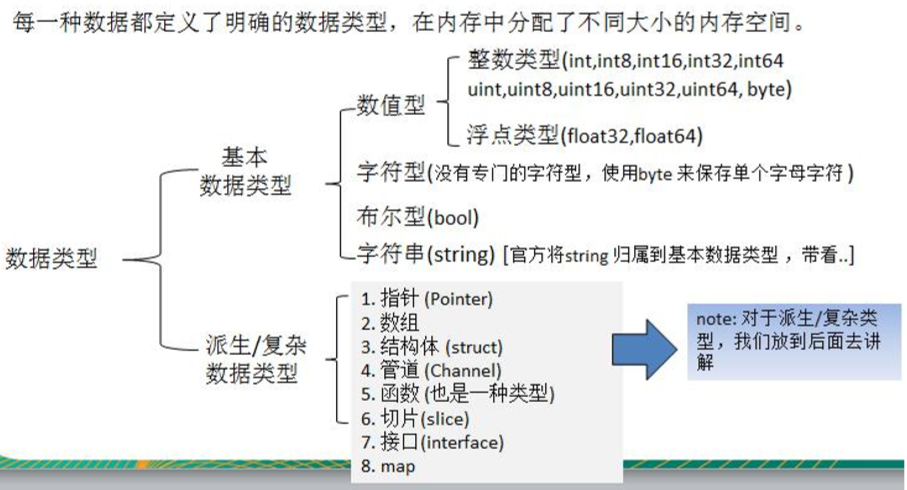

# 目录

- [变量](#变量)
- [数据类型](#数据类型)
- [指针](#指针)

## 变量

​	声明：var 变量名 数据类型

​	var a int

​	var b = 10  //如果直接赋值，可以省略数据类型

​	c := 100 //省略var，局部变量中使用，而且变量不能声明过

全局变量

~~~go
var a string = "hello"
var (
    n1 int = 100
    n2 = 200
)
~~~

## 数据类型

1. bool，一个字节，值是true或者false，不可以用0或者1表示（java中boolean占用4个字节，而boolean作为数组出现时，每个boolean占用1个字节）

2. int/uint(带符号为与不带符号位的int类型)：根据平台不同是32位或者64位
3. intx/uintx:x代表任意位数，例如：int3，代表占3bit的int类型
4. byte占用8位，一个字节，相当于uint8，不带符号位
5. floatx:由于没有double类型，所以float64就是double。float32小数精确到7位，float64小数精确到15位。
6. complex64/complex128:复数类型
7. uintptr:保存指针用的类型，也是随着平台改变而改变，因为指针的长度就是随平台而变。
8. 其他类型值：array，struct，string
9. 引用类型：slice，map，chan
10. 接口类型：interface
11. 函数类型：func

### 基本数据类型

**int**

int默认声明为int类型

~~~go
var inta = 1
fmt.Printf("%T",inta) //int
~~~

**float64**

浮点类型默认声明float64。

~~~go
var num = 1.1
fmt.Printf("%T",num) //float64
~~~

**byte**

Go中，字符的本质是一个整数，直接输出时，是该字符对应的UTF-8编码的码值。

~~~go
var c1 byte = 'z' //对于在ASCII中的字符，如[0-9,a-z,A-Z..]直接保存到byte
fmt.Println(c1) //122
fmt.Printf("%c",c1) //输出对应的unicode字符
fmt.Printf("%T",c1) //byte默认是uint8
var c2 = '哈' //或者var c2 int = '哈'，因为ASCII码值大于了255，所以不能使用byte
fmt.Printf("%T",c2) //不声明时，默认是int32
~~~

[三种常见字符编码简介-ASCII、Unicode和UTF-8](https://www.cnblogs.com/yuguangchuan/p/4310952.html)

字符类型本质探讨

 1. 字符串存储到计算机中，需要将字符对应的码值（整数）找出来

    存储：字符 => 对应码值 => 二进制 => 存储

    读取：二进制 => 码值 => 字符 => 读取

 2. Go语言，编码都统一成utf-8了。无乱码问题

**bool**占一个字节

**string**

1. 一旦赋值，不能更改。

   ~~~go
   var b  string = "hello"
   b[1] = 'a' //错误的
   ~~~

2. 使用utf-8编码标识Unicode。无乱码。

3. 本质是单个字节连接起来的。

4. 表现形式，双引号（识别转义字符），单引号（原样输出）

5. '+' 连接字符串时，+ 在上一行。

**基本类型默认值**

​	整型：	0

​	浮点型：	0

​	字符串：	“”

​	布尔：	false

**数据转换**

​	和java不一样，不能自动的隐式转换，必须显示转换

​	表达式 T(v)，把v转化为T类型

~~~go
var a int32 = 100
var b int64 = int64(a)
fmt.Println(a,b)
~~~

​	int64 转 int8编译不会报错，按溢出处理

- 基本数据转成string

  方法一：fmt.Sprintf("%参数", 表达式)

  ~~~go
  var num1 int = 99
  var str string //空的str
  str = fmt.Sprintf("%d", num1)
  fmt.Printf("str type %T str=%q\n", str, str)  //string "99"
  ~~~

  方法二：使用strconv包的函数

  [func FormatBool(b bool) string](http://docscn.studygolang.com/pkg/strconv/#FormatBool)

  [func FormatFloat(f float64, fmt byte, prec, bitSize int) string](http://docscn.studygolang.com/pkg/strconv/#FormatFloat)

  [func FormatInt(i int64, base int) string](http://docscn.studygolang.com/pkg/strconv/#FormatInt)

  [func FormatUint(i uint64, base int) string](http://docscn.studygolang.com/pkg/strconv/#FormatUint)

- string转基本类型

  使用strconv包的函数

  [func ParseBool(str string) (value bool, err error)](http://docscn.studygolang.com/pkg/strconv/#ParseBool)

  [func ParseFloat(s string, bitSize int) (f float64, err error)](http://docscn.studygolang.com/pkg/strconv/#ParseFloat)

  [func ParseInt(s string, base int, bitSize int) (i int64, err error)](http://docscn.studygolang.com/pkg/strconv/#ParseInt)

  [func ParseUint(s string, base int, bitSize int) (n uint64, err error)](http://docscn.studygolang.com/pkg/strconv/#ParseUint)

## 指针

## 特点

- 高并发

- 多个返回值

## 注意&规范

- 严格区分大小写。包名首字母大写是公开的，小写是私有的。无public private关键字。

- 驼峰命名法

- \+ 连接字符串时，+ 在上一行末尾

- 数据转换时，不会自动隐式转换，必须显示转换

- 方法的{ }，{ 必须写在上一行，不能换行

  func main() {

  }

- 语句末尾，不需要分号

- 定义了的变量，或者import的包，必须使用，不然报错

- 不能多条语句放一行