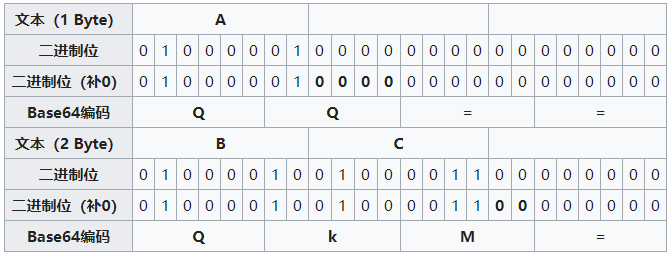
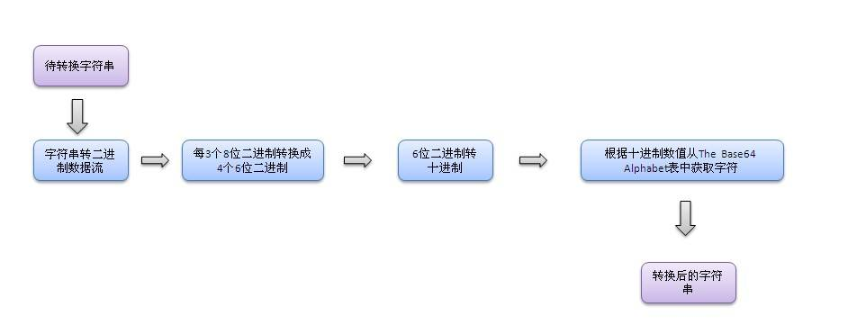

1. printf()、与fmt.printf()区别。

2. 对于全局变量，如何声明？如果全部都是大写，那么对外部包就是可见的。如果只对当前包可见，如何声明。

3. 在循环中使用加号	“+”拼接字符串并不是最高效的做法，更好的办法是使用函数`strings.Join()`，有 没有更好地办法了？有！使用字节缓冲（`bytes.Buffer`）拼接更加给力

4. new() 和 make() 的区别

   - new(T) 为每个新的类型T分配一片内存，初始化为 0 并且返回类型为*T的内存地址：这种方法 **返回一个指向类型为 T，值为 0 的地址的指针**，它适用于值类型如数组和结构体；它相当于 `&T{}`。
   - make(T) **返回一个类型为 T 的初始值**，它只适用于3种内建的引用类型：切片、map 和 channel。

5. 重新声明与再次赋值

   ~~~go
   f, err := os.Open(name)
   if err != nil {
       return err
   }
   d, err := f.Stat()
   if err != nil {
       f.Close()
       return err
   }
   ~~~

   调用了 `f.Stat`。它看起来似乎是声明了 `d` 和 `err`。 注意，尽管两个语句中都出现了 `err`，但这种重复仍然是合法的：`err` 在第一条语句中被声明，但在第二条语句中只是被**再次赋值**罢了。也就是说，调用 `f.Stat` 使用的是前面已经声明的 `err`，它只是被重新赋值了而已。

   ~~~go
   if b := 1; b > 2 {
   
   } else {
       b = 3 //这是if声明的b
       fmt.Println(b)
       b := "str"  //这里是新声明的一个b，if语句里面声明的b，在这里被隐藏掉了
       fmt.Println(b)
   }
   ~~~

   在满足下列条件时，已被声明的变量 `v` 可出现在`:=` 声明中：

   - 本次声明与已声明的 `v` 处于同一作用域中（若 `v` 已在外层作用域中声明过，则此次声明会创建一个新的变量），
   - 在初始化中与其类型相应的值才能赋予 `v`
   - 在此次声明中至少另有一个变量是新声明的。

6. for循环

   ~~~go
   for i, j := 0, 10; i < 10 && j > 0; i, j = i+1, j-1 {//使用多个变量控制循环
   }
   ~~~

7. 编解码

   **ASCII** （American Standard Code for Information Interchange，美国信息交换标准代码）

   ​	**标准ASCII 码**也叫基础ASCII码，使用7 位二进制数（剩下的1位二进制为0）来表示所有的大写和小写字母，数字0 到9、标点符号， 以及在美式英语中使用的特殊控制字符

   ​	在标准ASCII中，其最高位(b7)用作奇偶校验位。所谓奇偶校验，是指在代码传送过程中用来检验是否出现错误的一种方法，一般分奇校验和偶校验两种。奇校验规定：正确的代码一个字节中1的个数必须是奇数，若非奇数，则在最高位b7添1；偶校验规定：正确的代码一个字节中1的个数必须是偶数，若非偶数，则在最高位b7添1。

   **UTF-8**（**8-bit Unicode Transformation Format**）

   ​	是一种针对Unicode的**可变长度**字符编码，也是一种前缀码。它可以用来表示Unicode标准中的任何字符，且其编码中的第一个字节仍与ASCII兼容，这使得原来处理ASCII字符的软件无须或只须做少部分修改，即可继续使用。因此，它逐渐成为邮箱、网页及其他存储或发送文字的应用中，优先采用的编码。

   1. 128个US-ASCII字符只需一个字节编码（Unicode范围由U+0000至U+007F）。

   2. 带有附加符号的拉丁文、希腊文、西里尔字母、亚美尼亚语、希伯来文、阿拉伯文、叙利亚文及它拿字母则需要两个字节编码（Unicode范围由U+0080至U+07FF）。

   3. 其他基本多文种平面（BMP）中的字符（这包含了大部分常用字，如大部分的汉字）使用三个字节编码（Unicode范围由U+0800至U+FFFF）。

   4. 其他极少使用的Unicode 辅助平面的字符使用四至六字节编码（Unicode范围由U+10000至U+1FFFFF使用四字节，Unicode范围由U+200000至U+3FFFFFF使用五字节，Unicode范围由U+4000000至U+7FFFFFFF使用六字节）。

      **UTF-8编码字节含义**

      - 对于UTF-8编码中的任意字节B，如果B的第一位为0，则B独立的表示一个字符(ASCII码)；

      - 如果B的第一位为1，第二位为0，则B为一个多字节字符中的一个字节(非ASCII字符)；

      - 如果B的前两位为1，第三位为0，则B为两个字节表示的字符中的第一个字节；

      - 如果B的前三位为1，第四位为0，则B为三个字节表示的字符中的第一个字节；

      - 如果B的前四位为1，第五位为0，则B为四个字节表示的字符中的第一个字节；

        因此，对UTF-8编码中的任意字节，根据第一位，可判断是否为ASCII字符；根据前二位，可判断该字节是否为一个字符编码的第一个字节；根据前四位（如果前两位均为1），可确定该字节为字符编码的第一个字节，并且可判断对应的字符由几个字节表示；根据前五位（如果前四位为1），可判断编码是否有错误或数据传输过程中是否有错误。

   **Base64**

   ​	是一种基于64个可打印字符来表示二进制数据的表示方法。由于2^6 = 64 ，所以每6个比特为一个单元，对应某个可打印字符。3个字节有24个比特，对应于4个Base64单元，即3个字节可由4个可打印字符来表示。它可用来作为电子邮件的传输编码。在Base64中的可打印字符包括字母A-Z、a-z、数字0-9，这样共有62个字符，此外两个可打印符号在不同的系统中而不同（标准base64是+ /，url中base64是- _）。

   ​	如果要编码的字节数（byte）不能被3整除，最后会多出1个或2个字节，那么可以使用下面的方法进行处理：先使用0字节值在末尾补足，使其能够被3整除，然后再进行Base64的编码。在编码后的Base64文本后加上一个或两个`=`号，代表补足的字节数。也就是说，当最后剩余两个八位字节（2个byte）时，最后一个6位的Base64字节块有四位是0值，最后附加上两个等号；如果最后剩余一个八位字节（1个byte）时，最后一个6位的base字节块有两位是0值，最后附加一个等号。 参考下表：



​	编码后的数据比原始数据略长，为原来的4/3。六位二进制转十进制，补了2个0。看下图就理解了



```go
//uuid使用base64编码。错误的做法。
func UuidAndBase64() (string, string) {
   //38e5a214-a814-4356-9425-e4cf1b404817
   uuidStr := uuid.New()  //uuid是32个十六进制编码的字符，16进制=>2^4=16,
   // 所以4个2进制表示一个字符=>1个字节两个字符,
   // 最终uuid->32个16进制编码的字符-> 16个字节->128bit。
   uuidBase64 := uuidStr.NodeID() //这里NodeId是截取的后面6个字节，copy(node[:], uuid[10:])。所以，不是完整的uuid。
   //这样做，uuid=38e5a214-a814-4356-9425-e4cf1b404817，base64编码=5M8bQEgX=e4cf1b404817(16进制)
   return uuidStr.String(), base64.StdEncoding.EncodeToString(uuidBase64)
   //base64=>2^6=64，所以6个二进制表示一个字节，128/6需要补位，最后为22位。
}
```